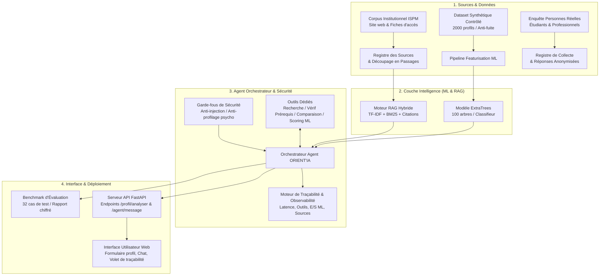

# Architecture du Système ORIENT'IA

## 1. Vue d'ensemble du Système

ORIENT'IA est un système hybride combinant l'apprentissage statistique (Machine Learning), la recherche d'information augmentée par la génération (RAG) et une couche d'orchestration conversationnelle sous contraintes éthiques et réglementaires.

---

## 2. Description des Composants

### 2.1 Moteur RAG et Traçabilité (`orient_ia/rag/`)
- Ingestion du corpus vérifié `donnees/corpus_pedagogique.json`.
- Indexation vectorielle hybride (n-grammes TF-IDF et filtrage sémantique).
- Extraction systématique de la source de provenance (URL, date de consultation, statut institutionnel).
- Gestion stricte de l'absence d'information : toute mention ou matière non officielle est signalée comme absente.

### 2.2 Composant Machine Learning (`orient_ia/ml/`)
- Modèle de classification supervisé `ExtraTreesClassifier` entraîné avec protocole strict anti-fuite.
- Transformation reproductible des variables textuelles et catégorielles.
- Sortie probabiliste calibrée et calcul de score d'adéquation indicatif accompagné de son niveau d'incertitude.

### 2.3 Agent Conversationnel et Garde-fous (`orient_ia/agent/`)
- **Outils identifiables :** `rechercher_formation`, `analyser_profil_ml`, `verifier_prerequis`, `comparer_parcours`.
- **Garde-fous éthiques :**
  - Blocage des tentatives de détournement de consignes (prompt injections).
  - Refus formel du profilage psychologique et de l'inférence de traits de personnalité.
  - Refus strict de tout critère discriminatoire (sexe, âge).
  - Clarification administrative : rappel que seul le conseil de sélection de l'ISPM valide les admissions.

### 2.4 API Backend & Interface Utilisateur (`orient_ia/api/` & `interface/`)
- API RESTful FastAPI fournissant les services en temps réel.
- Interface web ergonomique avec mention légale obligatoire, formulaire de profilage, chat interactif et volet dépliable d'observabilité.
